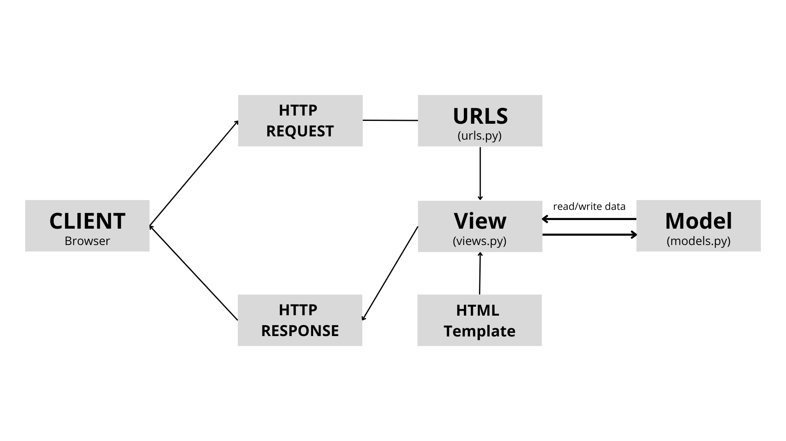

Link menuju aplikasi PWS yang sudah di-deploy : http://naira-shafiqa-naiexpress1.pbp.cs.ui.ac.id/

# Jawaban Pertanyaan Tugas 2

## Pertanyaan 1

_Jelaskan bagaimana cara kamu mengimplementasikan checklist di atas secara step-by-step (bukan hanya sekadar mengikuti tutorial)._

Jawaban :

### Step 1: Setup Proyek dan Lingkungan Django

Pada tahap ini, saya menyiapkan _environment_ untuk proyek Django agar dapat berjalan dengan baik.

1. **Membuat Direktori Proyek**  
   Saya akan membuat direktori khusus untuk proyek ini dengan nama direktori `nai-express` dan mengaktifkan virtual environment untuk memastikan bahwa semua dependensi proyek tidak bercampur dengan proyek lain.

   ```bash
   mkdir nai-express
   cd nai-express
   ```

2. **Aktifkan Virtual Environment**  
   Saya membuat virtual environment agar proyek ini terisolasi dari dependensi global.

   ```bash
   python -m venv env
   source env/bin/activate  # MacOS/Linux
   env\Scripts\activate     # Windows
   ```

3. **Instalasi Django dan Dependencies**  
   Setelah virtual environment diaktifkan, saya menginstal Django dan dependensi lain yang diperlukan dengan menjalankan perintah:

   ```bash
   pip install django
   ```

4. **Membuat `requirements.txt`**  
   File `requirements.txt` akan mencatat semua dependensi proyek yang diinstal untuk memudahkan pengembang lain atau deployment proyek:

   ```bash
    pip install -r requirements.txt
   ```

5. **Membuat Proyek Django**  
   Dengan menjalankan perintah berikut, saya membuat proyek Django baru:

   ```bash
   django-admin startproject nai_project .
   ```

6. **Konfigurasi `settings.py`**  
   Saya perlu menambahkan `ALLOWED_HOSTS` di `settings.py` agar proyek bisa berjalan di `localhost` dan domain yang ditentukan situs PBP:

   ```python
    ALLOWED_HOSTS = ["localhost", "127.0.0.1", "naira-shafiqa-naiexpress1.pbp.cs.ui.ac.id"]
   ```

### Step 2: Membuat Aplikasi dan Konfigurasi (MTV) Proyek

Setelah proyek Django dibuat, saya akan menambahkan aplikasi bernama `main` yang akan menangani logika utama dari proyek.

1. **Membuat Aplikasi**  
   Perintah ini akan membuat aplikasi bernama `main` di dalam proyek:

   ```bash
   python manage.py startapp main
   ```

2. **Menambahkan Aplikasi ke `settings.py`**  
   Agar aplikasi `main` dikenali oleh proyek, saya menambahkannya di dalam daftar `INSTALLED_APPS` yang ada di `settings.py`:

   ```python
   INSTALLED_APPS = [
       ...
       'main',
   ]
   ```

3. **Menjalankan Proyek Secara Lokal**  
   Untuk melihat apakah proyek dan aplikasi sudah berfungsi dengan baik, saya menjalankan server Django secara lokal:

   ```bash
   python manage.py runserver
   ```

4. **Membuat Template HTML**
   Saya membuat direktori templates di dalam aplikasi main dan menambahkan file main.html yang berisi template variables untuk menampilkan produk.

   Saya menambahkan CSS untuk memberikan style pada halaman agar lebih menarik.

5. **Modifikasi Model**
   Saya mengubah model `Product` di dalam `models.py` agar sesuai dengan spesifikasi tugas :

   ```bash
   class Product(models.Model):
      name = models.CharField(max_length=255)
      price = models.IntegerField()
      description = models.TextField()
      image = models.CharField(max_length=255, default='images/default.avif')
      availability = models.CharField(max_length=50, default='In Stock')
      stock = models.IntegerField(default=0)
      discount = models.CharField(max_length=20, default='No discount')
   ```

6. **Migrasi Model**
   Setelah melakukan perubahan model, saya menjalankan perintah berikut untuk melakukan migrasi:

   ```bash
   python manage.py makemigrations
   python manage.py migrate
   ```

7. **Menghubungkan View dengan Template**
   Saya membuat fungsi `show main` di `views.py` untuk menampilkan produk dari database di template.

   ```bash
   from django.shortcuts import render
   from .models import Product


   def show_main(request):
      products = Product.objects.all()
      return render(request, 'main/main.html', {'products': products})
   ```

8. **Mengkonfigurasi Routing URL**
   Saya membuat file `urls.py` di dalam aplikasi `main` untuk mengatur routing halaman.

   ```bash
   from django.urls import path
   from main.views import show_main


   app_name = 'main'


   urlpatterns = [
      path('', show_main, name='show_main'),
   ]
   ```

## Pertanyaan 2

_Buatlah bagan yang berisi request client ke web aplikasi berbasis Django beserta responnya dan jelaskan pada bagan tersebut kaitan antara `urls.py`, `views.py`, `models.py`, dan berkas `html`._

Jawaban :



Diagram ini menunjukkan alur permintaan (request) dari klien dalam aplikasi web berbasis Django. Berikut penjelasan alur secara rinci:

1. **Klien (Browser)**

Klien, biasanya browser, mengirimkan HTTP Request (permintaan HTTP) ke aplikasi web. Permintaan ini bisa berupa permintaan untuk halaman tertentu atau data (misalnya, /products/).

2. **URLs (urls.py)**
   Permintaan pertama kali diteruskan ke file urls.py. File ini berfungsi untuk memetakan URL yang diminta ke fungsi view yang sesuai. Misalnya, jika permintaan adalah untuk halaman /products/, urls.py akan menentukan fungsi view mana yang harus menangani permintaan tersebut.

3. **View (views.py)**
   Setelah permintaan dipetakan, permintaan tersebut diteruskan ke fungsi view yang berada di views.py. Fungsi ini memproses permintaan dan, jika diperlukan, berinteraksi dengan Model (models.py) untuk mengambil atau menulis data.

4. **Model (models.py)**
   berperan sebagai representasi struktur basis data. View dapat mengambil data yang diperlukan (misalnya, daftar produk atau detail pengguna) atau memperbarui basis data melalui model.
   HTML Template: Setelah data diproses, view akan meneruskannya ke template HTML yang berfungsi untuk merender (menyusun) halaman dengan konten dinamis yang sesuai.

5. **HTTP Response**
   Template HTML yang sudah dirender dikembalikan sebagai HTTP Response (respons HTTP), yang kemudian dikirim kembali ke browser klien untuk ditampilkan.

Alur ini memastikan bahwa permintaan klien ditangani secara efisien oleh setiap komponen Django. URLs memetakan permintaan, views memprosesnya, models berinteraksi dengan basis data, dan template merender tampilan akhir yang dikirim kembali kepada klien.

Referensi : https://learnbatta.com/blog/understanding-request-response-lifecycle-in-django-29/

## Pertanyaan 3

_Jelaskan fungsi git dalam pengembangan perangkat lunak!_

Jawaban :

Git adalah sistem kontrol versi modern yang paling banyak digunakan di dunia saat ini. Git memainkan peran penting dalam pengembangan perangkat lunak dengan menyediakan arsitektur terdistribusi yang memungkinkan setiap salinan kode pengembang juga bertindak sebagai repository penuh yang mencakup seluruh riwayat perubahan.

Berikut adalah beberapa fungsi utama Git dalam pengembangan perangkat lunak:

1. Versi Kontrol Terdistribusi (DVCS):

Git memungkinkan setiap pengembang memiliki salinan lengkap dari riwayat proyek, bukan hanya satu server pusat. Ini membuat kolaborasi lebih fleksibel karena pengembang dapat bekerja secara offline dan mengunggah perubahan mereka nanti.

2. Kinerja Tinggi:

Git dirancang untuk memberikan kinerja yang optimal. Operasi seperti commit, branching, dan merging dilakukan dengan cepat karena Git menggunakan algoritma yang dioptimalkan untuk menangani pohon file kode sumber.

3. Keamanan:

Git menjamin integritas kode dan riwayat perubahan dengan menggunakan algoritma hashing kriptografi (SHA1). Ini memastikan bahwa semua perubahan dapat dilacak secara aman dan terhindar dari modifikasi berbahaya atau tak terduga.

4. Fleksibilitas:

Git sangat fleksibel dalam mendukung berbagai alur kerja pengembangan yang tidak linear, proyek besar atau kecil, dan kompatibel dengan banyak sistem dan protokol. Branching dan tagging merupakan fitur penting dalam Git yang memungkinkan tim melacak versi perangkat lunak dengan lebih efektif.

Git memberikan pengembang perangkat lunak alat yang kuat untuk mengelola perubahan kode secara efisien, aman, dan fleksibel, yang membuatnya menjadi pilihan utama di antara tim pengembang di seluruh dunia.

Referensi : https://www.atlassian.com/git/tutorials/what-is-git

## Pertanyaan 4

_Menurut Anda, dari semua framework yang ada, mengapa framework Django dijadikan permulaan pembelajaran pengembangan perangkat lunak?_

Jawaban :

1. **Menggunakan Bahasa Python yang Populer dan Mudah Dipelajari**
   Django dibangun dengan Python, salah satu bahasa pemrograman paling populer dan efektif. Python dikenal mudah dipelajari dan digunakan, sehingga Django sangat cocok untuk pemula dalam pengembangan perangkat lunak.

2. **Fitur Bawaan yang Lengkap**
   Django hadir dengan berbagai fitur bawaan seperti ORM, area admin, migrasi database, dan autentikasi. Ini memungkinkan pengembang langsung fokus pada pengembangan aplikasi tanpa harus menyiapkan banyak hal dari awal.

3. **Modular dan Reusable**
   Django menerapkan konsep aplikasi yang dapat digunakan kembali, sehingga kode dapat dimodularisasi dengan baik. Ini membuat pengembangan proyek lebih efisien dan mudah diperluas seiring waktu.

4. **Komunitas Besar dan Dokumentasi Lengkap**
   Django memiliki komunitas besar dan aktif, ditambah dengan dokumentasi yang sangat lengkap. Banyak sumber daya yang tersedia untuk membantu ketika menghadapi kesulitan, baik melalui komunitas maupun dokumentasi resmi.

5. **Mempermudah Pembelajaran Framework Lain**
   Belajar Django memberikan fondasi kuat dalam pengembangan web, sehingga lebih mudah untuk mempelajari framework lain. Konsep yang dipelajari di Django dapat diterapkan pada banyak framework lain dalam pengembangan perangkat lunak.

Referensi : https://dev.to/msnmongare/mastering-django-now-a-comprehensive-guide-from-beginner-to-advanced-4b2d

## Pertanyaan 5

_Mengapa model pada Django disebut sebagai ORM?_

Jawaban :

Django Web Framework sudah menyertakan **Object-Relational Mapping (ORM)**, yang memungkinkan pengguna berinteraksi dengan data dari berbagai relational databases dengan cara yang lebih sederhana dan efisien. Django ORM memungkinkan untuk menambah (add), menghapus (delete), memodifikasi (modify), dan melakukan query terhadap objek, semuanya melalui antarmuka API yang disebut ORM.

ORM itu sendiri adalah singkatan dari Object-Relational Mapping, yaitu sebuah teknik yang memetakan model-model objek dalam kode Python ke tabel-tabel dalam basis data relasional. Hal ini berarti, data dapat diolah menggunakan objek-objek Python tanpa perlu menulis perintah SQL secara manual. Misalnya, ketika kita ingin mengambil data dari tabel, cukup lakukan query menggunakan Python, dan ORM akan menerjemahkannya menjadi perintah SQL yang sesuai.

Referensi : https://www.scaler.com/topics/django/django-orm/

# Jawaban Pertanyaan Tugas 3

## Pertanyaan 1

_Jelaskan mengapa kita memerlukan data delivery dalam pengimplementasian sebuah platform?._

Jawaban :
Data delivery diperlukan dalam pengimplementasian sebuah platform karena:

Data delivery diperlukan dalam pengimplementasian sebuah platform karena memungkinkan website untuk menerima input dari pengguna, memprosesnya, dan menyimpannya di dalam database. Ketika pengguna meminta data tersebut, kita hanya perlu memanggil fungsi yang akan mengambil dan menyajikan data sesuai permintaan. Dengan data delivery yang tepat, platform dapat mengelola pengiriman dan penyajian data secara efisien dan aman, memastikan bahwa data yang diberikan konsisten dan up-to-date.

Selain itu, data delivery juga penting untuk menjaga responsivitas dan ketersediaan platform, terutama saat melayani banyak pengguna secara bersamaan. Dengan strategi data delivery yang baik, platform dapat menangani permintaan yang tinggi tanpa menurunkan performa atau mengalami lag. Misalnya, sistem real-time seperti website e-commerce yang membutuhkan pengiriman data yang cepat dan akurat untuk menjaga interaksi pengguna tetap mulus​

## Pertanyaan 2

_Menurutmu, mana yang lebih baik antara XML dan JSON? Mengapa JSON lebih populer dibandingkan XML?_

Jawaban :

Menurut saya pribadi, **JSON lebih baik dibandingkan XML** dalam konteks pengembangan aplikasi web, dan ada beberapa alasan mengapa JSON lebih sering digunakan:

1. **Kemudahan Parsing**

   JSON dapat langsung diuraikan (parsed) oleh JavaScript dengan mudah, karena merupakan format native yang didukung oleh browser modern. Tidak memerlukan parser khusus seperti halnya XML, sehingga membuat JSON lebih cepat dan praktis dalam penggunaan di aplikasi web.

2. **Ringkas dan Lebih Mudah Dibaca**

   JSON tidak menggunakan tag pembuka dan penutup seperti XML, sehingga membuat data lebih ringkas dan mudah dibaca. Dalam aplikasi web, ini sangat penting karena mempengaruhi kecepatan pengiriman dan penerimaan data antara server dan klien​.

3. **Efisiensi Ukuran File**

   Karena JSON menggunakan format yang lebih sederhana, ukuran file data yang ditransfer lebih kecil dibandingkan XML. Ini mempercepat proses pertukaran data di aplikasi web, yang sering kali membutuhkan efisiensi tinggi terutama dalam koneksi jaringan.

4. **Dukungan untuk Array**

   Dalam aplikasi web, penggunaan array sangat umum, dan JSON mendukung array secara langsung, membuatnya lebih mudah untuk memproses data yang berbentuk daftar atau kumpulan objek. XML, di sisi lain, tidak memiliki dukungan native untuk array, sehingga memerlukan struktur tambahan.

Referensi : https://aws.amazon.com/compare/the-difference-between-json-xml/
https://www.w3schools.com/js/js_json_xml.asp

## Pertanyaan 3

_Jelaskan fungsi dari method `is_valid()` pada form Django dan mengapa kita membutuhkan method tersebut?_

Jawaban :

Method `is_valid()` pada form Django berfungsi untuk **memvalidasi data yang dikirimkan** melalui form. Ketika form terikat dengan data (bound form), `is_valid()` akan menjalankan semua aturan validasi yang didefinisikan di form, seperti validasi tipe data atau apakah field wajib sudah diisi. Hasilnya adalah nilai boolean: **True** jika data yang dimasukkan valid, dan **False** jika ada kesalahan pada data.

Alasan mengapa kita membutuhkan `is_valid()` adalah:

1. **Mencegah Penyimpanan Data yang Tidak Valid**: Dengan menggunakan `is_valid()`, kita bisa memastikan bahwa hanya data yang valid yang akan disimpan ke dalam database. Ini penting untuk mencegah terjadinya error atau inkonsistensi dalam sistem.

2. **Menangani Error Secara Efektif**: Jika data tidak valid, `is_valid()` akan mengembalikan False, dan Django akan menyediakan informasi tentang kesalahan tersebut melalui atribut `form.errors`. Ini membantu dalam menampilkan pesan kesalahan yang relevan kepada pengguna dan memungkinkan mereka memperbaiki input mereka.

3. **Validasi Terpusat**: Django memudahkan pengembang dengan mengatur validasi data di satu tempat (form), sehingga kode lebih bersih dan lebih mudah dipelihara dibandingkan memvalidasi data secara manual di berbagai bagian aplikasi.

Dengan demikian, `is_valid()` adalah komponen inti yang memastikan bahwa data yang diterima oleh form sesuai dengan persyaratan yang ditentukan, serta membantu aplikasi mengelola input pengguna dengan lebih aman dan terstruktur.

Referensi : https://docs.djangoproject.com/en/5.1/ref/forms/api/

## Pertanyaan 4

_Mengapa kita membutuhkan `csrf_token` saat membuat form di Django? Apa yang dapat terjadi jika kita tidak menambahkan `csrf_token` pada form Django? Bagaimana hal tersebut dapat dimanfaatkan oleh penyerang?_

Jawaban :

`csrf_token` dibutuhkan dalam form Django untuk melindungi aplikasi web dari serangan Cross-Site Request Forgery (CSRF). CSRF adalah kerentanan keamanan web yang memungkinkan penyerang membuat pengguna tanpa sadar melakukan tindakan yang tidak mereka niatkan pada sebuah situs web. Serangan ini memungkinkan penyerang untuk mengeksploitasi sesi pengguna yang sudah diautentikasi dan mengirimkan permintaan yang tampaknya sah dari pengguna tersebut.

Jika tidak ada csrf_token, ini berarti penyerang dapat :

1. Mengambil alih akun pengguna: Penyerang bisa mengirimkan permintaan yang terlihat sah (seperti mengubah kata sandi atau melakukan transaksi) atas nama pengguna yang telah login ke aplikasi.

2. Eksploitasi Sesi Pengguna: Karena browser secara otomatis mengirimkan cookie autentikasi pada setiap permintaan ke server, penyerang dapat menggunakan sesi pengguna yang valid untuk memanipulasi tindakan yang tidak diinginkan.
   Penyerang dapat membuat halaman web jahat yang mengirimkan permintaan POST ke aplikasi Django yang tidak terlindungi. Karena browser korban masih memiliki sesi yang valid dengan server, permintaan tersebut akan tampak sah bagi server, sehingga permintaan tersebut dieksekusi tanpa sepengetahuan korban. Tanpa csrf_token, aplikasi tidak memiliki cara untuk memastikan bahwa permintaan berasal dari pengguna yang sah atau dari sumber eksternal yang tidak sah​

Referensi : https://portswigger.net/web-security/csrf

## Pertanyaan 5

_Jelaskan bagaimana cara kamu mengimplementasikan checklist di atas secara step-by-step (bukan hanya sekadar mengikuti tutorial)._

Jawaban :

Untuk mengimplementasikan checklist di atas, berikut adalah langkah-langkah yang saya lakukan secara detail :

1. **Membuat Form untuk Input Data**
   Saya membuat form dengan cara mendefinisikan `forms.py` menggunakan `ModelForm`. Lalu, menghubungkan form tersebut dengan model `Product`.
2. **Menambahkan Views untuk Menampilkan Data Dalam Format XML dan JSON**

   Saya membuat beberapa fungsi views di `views.py` untuk mengembalikan data dalam formal XML dan JSON berdasarkan ID.

3. **Routing URL**

   Saya menambahkan route URL di `urls.py` untuk mengakses view yang sudah saya buat.

4. **Validasi dan Penggunaan Method `is_valid()`**
   Saat menerima input dari form, saya memvalidasi validasi sebelum menyimpan data ke database.

5. **Menambahkan CSRF Token**
   Hal ini dilakukan untuk mencegah serangan CSRF. Ini dilakukan dengan memasukkan ``

6. **Testing dengan Postman**
   Memastikan bahwa data terkirim dan ditampilkan dengan benar.

## Dokumentasi Postman


# Jawaban Pertanyaan Tugas 4

## Pertanyaan 1

_Apa perbedaan antara HttpResponseRedirect() dan redirect()_

Jawaban :
Dalam pengembangan web dengan Django, kedua fungsi ini digunakan untuk mengarahkan pengguna ke halaman yang berbeda setelah suatu aksi dilakukan. Namun, terdapat beberapa perbedaan penting di antara keduanya:

`HttpResponseRedirect()`

- **Asal** :

  Berasal dari library Django `django.http`

- **Fungsi Utama** :

  Mengarahkan user ke URL tertentu setelah suatu aksi dilakukan.

- **Kontrol** :

  Memberikan kontrol penuh atas semua aspek respons redirect, termasuk status HTTP (302 Moved Temporarily atau 301 Moved Permanently), header tambahan, dan URL tujuan.

- **Penggunaan** :

  Digunakan ketika perlu kustomisasi secara detail mengenai bagaimana redirect terjadi. Contohnya adalah ketika perlu untuk mengatur status HTTP khusus atau menambahkan header tertentu.

`redirect()`

- **Asal**:

  Berasal dari library `django.shortcuts`

- **Fungsi Utama** :

  Digunakan untuk mengarahkan pengguna ke URL tertentu.

- **Kontrol** :

  `redirect()` secara otomatis membuat instance HttpResponseRedirect dengan mengambil input yang diberikan, seperti URL, nama view, atau objek model, dan mengelola redirect dengan status HTTP default 302.

- **Penggunaan** :
  redirect() digunakan untuk kemudahan dan fleksibilitas, mengurangi boilerplate code, dan menangani berbagai jenis input tanpa perlu penanganan manual. Ini adalah pilihan yang lebih praktis untuk kasus-kasus umum di mana kustomisasi khusus tidak diperlukan.

Kesimpulannya adalah, `HttpResponseRedirect()` memberikan **kontrol lebih detail**, sedangkan `redirect()` menawarkan **kemudahan dan fleksibilitas** dengan mengotomatisasi beberapa langkah dalam proses redirect.

References:

https://www.geeksforgeeks.org/django-redirects/
https://docs.djangoproject.com/en/5.1/intro/tutorial04/

## Pertanyaan 2

_Jelaskan cara kerja penghubungan model MoodEntry dengan User!_

Jawaban :

Di dalam model, ada relasi `ForeignKey` yang menghubungkan setiap produk dengan satu pengguna (`User`). Jadi, setiap produk yang dibuat dalam aplikasi ini dimiliki atau dikelola oleh satu pengguna tertentu.

- Relasi `ForeignKey`:

```
user = models.ForeignKey(User, on_delete=models.CASCADE)
```

Relasi ini menghubungkan model MoodEntry dengan model `User`, artinya setiap produk yang dibuat dikaitkan dengan pengguna tertentu. `on_delete=models.CASCADE` berarti jika pengguna dihapus, semua produk yang terkait dengan pengguna tersebut juga akan ikut dihapus dari database.

- Pada views.py, di fungsi `show_main`:

  Pada baris `mood_entries = MoodEntry.objects.filter(user=request.user)` , query ini digunakan untuk mengambil semua entri suasana hati yang terkait dengan pengguna yang sedang login (`request.user`). Ini menunjukkan bagaimana relasi ForeignKey digunakan untuk menghubungkan data MoodEntry dengan pengguna yang membuat entri tersebut.

- Pada views.py, di fungsi `create_mood_entry`:

  Di sini, setelah form valid, entri suasana hati baru dibuat dan dikaitkan dengan pengguna yang sedang login melalui mood_entry.user = request.user. Ini memastikan bahwa entri yang baru dibuat terhubung dengan pengguna yang membuatnya.

Relasi ForeignKey antara `MoodEntry` dan `User` memungkinkan setiap entri suasana hati dikaitkan dengan satu pengguna tertentu. Ini sangat berguna dalam aplikasi, karena memungkinkan pengambilan, penyimpanan, dan pengelolaan data entri suasana hati yang spesifik untuk setiap pengguna. Implementasi relasi ini dapat dilihat dalam view `show_main` dan `create_mood_entry`, di mana data entri suasana hati diambil dan disimpan sesuai dengan pengguna yang sedang login.

## Pertanyaan 3

_Apa perbedaan antara authentication dan authorization, apakah yang dilakukan saat pengguna login? Jelaskan bagaimana Django mengimplementasikan kedua konsep tersebut._

Jawaban :
Perbedaan antara Authentication dan Authorization:

- **Authentication** (Autentikasi) adalah proses untuk memverifikasi identitas seorang pengguna. Artinya, memastikan bahwa seseorang adalah benar-benar siapa yang mereka klaim. Dalam konteks login, ini biasanya melibatkan verifikasi kredensial seperti username dan password.
- **Authorization** (Otorisasi) adalah proses yang terjadi setelah autentikasi, yang menentukan tingkat akses pengguna. Ini berhubungan dengan pemberian izin kepada pengguna untuk mengakses sumber daya atau melakukan tindakan tertentu berdasarkan tingkat akses yang telah diberikan kepada mereka.

Proses yang terjadi saat _user_ melakukan login :

Saat pengguna login, Django pertama-tama melakukan autentikasi dengan memverifikasi kredensial yang dimasukkan oleh pengguna (seperti username dan password). Jika autentikasi berhasil, Django kemudian mengelola otorisasi untuk menentukan hak akses pengguna tersebut di aplikasi. Misalnya, Django akan menentukan apakah pengguna tersebut memiliki hak untuk mengakses halaman tertentu, atau melakukan tindakan spesifik berdasarkan peran dan izin yang telah ditetapkan.

Implementasi Authentication dan Authorization di Django :

1. Authentication

- Sistem autentikasi bawaan Django terdapat pada modul `django.contrib.auth`. Proses ini melibatkan pengecekkan username dan password terhadap data yang ada di database.
- Fungsi `authenticate()` digunakan untuk memverifikasi kredensial pengguna. Jika valid, fungsi ini mengembalikan objek `User`, yang kemudian dapat digunakan untuk melakukan login dengan fungsi `login()`.

2. Authorization

- Django mengelola otorisasi menggunakan peran dan izin yang terhubung dengan objek User dan Group. Misalnya, pengguna dapat diberikan izin spesifik seperti can_add, can_edit, atau can_delete untuk model tertentu.
- Django juga menyediakan decorator seperti @login_required

References :

https://www.fortinet.com/de/resources/cyberglossary/authentication-vs-authorization#:~:text=Authentication%20is%20a%20process%20to,access%20based%20on%20that%20level.
https://docs.djangoproject.com/en/5.1/topics/auth/default/

## Pertanyaan 4

_Bagaimana Django mengingat pengguna yang telah login? Jelaskan kegunaan lain dari cookies dan apakah semua cookies aman digunakan?._

Jawaban :

Bagaimana Django Mengingat Pengguna yang Telah Login:

- Django menggunakan sessions dan middleware untuk mengintegrasikan sistem autentikasi ke dalam objek request. Ketika pengguna login, Django membuat sesi yang dihubungkan dengan pengguna, menyimpan ID sesi di server, dan mengirimkan ID tersebut ke browser pengguna melalui cookie.

Django menambahkan atribut request.user ke setiap request, yang merepresentasikan pengguna saat ini. Jika pengguna belum login, request.user akan menjadi instance AnonymousUser. Jika pengguna sudah login, atribut ini akan menjadi instance User.
Dengan cara ini, Django mengingat pengguna yang telah login pada setiap permintaan berikutnya, selama sesi aktif dan cookie sesi valid.

Kegunaan Lain dari Cookies:

1. Menyimpan Preferensi Pengguna: Seperti bahasa atau pengaturan tampilan.

2. Pelacakan Aktivitas Pengguna: Membantu pengiklan menargetkan iklan berdasarkan perilaku pengguna.

3. Menyimpan Data Keranjang Belanja: Menyimpan item di keranjang belanja dalam situs e-commerce.

Apakah Semua Cookies Aman Digunakan?

Tidak semua cookies aman. Meskipun cookies itu sendiri tidak berbahaya, mereka bisa disalahgunakan jika dicuri. Penyerang dapat mengambil alih sesi pengguna atau mencuri informasi pribadi. Oleh karena itu, cookies harus dikelola dengan benar, misalnya menggunakan atribut Secure dan HttpOnly.

Reference :
https://docs.djangoproject.com/en/5.1/topics/auth/default/#:~:text=Django%20uses%20sessions%20and%20middleware,which%20represents%20the%20current%20user.

https://www.geeksforgeeks.org/django-cookie/

https://blog.sucuri.net/2023/01/what-are-cookies-a-short-guide-to-managing-your-online-privacy.html#:~:text=Brave-,Can%20cookies%20be%20harmful%3F,otherwise%20abuse%20your%20cookie%20data.

## Pertanyaan 5

_Jelaskan bagaimana cara kamu mengimplementasikan checklist di atas secara step-by-step (bukan hanya sekadar mengikuti tutorial)._

Jawaban :

1. Membuat Fungsi dan From Registrasi
   Pada views.py saya menambahkan import `UserCreationForm` dan `messages` pada bagian paling atas.
2. Menambah fungsi register pada `views.py`.
   Fungsi register ditambahkan pada views.py untuk memungkinkan pengguna membuat akun baru. Fungsi ini memanfaatkan UserCreationForm, sebuah form bawaan Django yang dirancang untuk memudahkan pembuatan akun pengguna.
3. Membuat `register.html` pada direktori `main/templates`.
4. Membuat fungsi login pada `views.py`.
   Fungsi login_user ditambahkan pada views.py untuk memungkinkan pengguna yang sudah terdaftar melakukan login ke dalam aplikasi. Fungsi ini menggunakan `AuthenticationForm`, sebuah form bawaan Django yang dirancang untuk menangani autentikasi pengguna.
5. Membuat `login.html` pada direktori `main/templates`.
6. Membuat fungsi logout pada `views.py`.
   Fungsi logout_user ditambahkan pada views.py untuk memungkinkan pengguna keluar dari sesi login mereka. Fungsi ini menggunakan logout dari Django untuk mengakhiri sesi pengguna yang sedang login.
7. Menambahkan button Logout di main.html yang mengeksekusi logout dengan _hyperlink_ tag
8. Menambah path url ke `urlpatterns` untuk mengakses fungsi register, login, dan logout yang baru saja dibuat

9. Menambahkan Cookie `last_login` pada Fungsi `login_user `jika `form.is_valid()`
   Dengan menambahkan cookie last_login, situs dapat menyimpan informasi tentang kapan pengguna terakhir kali login, yang bisa digunakan untuk berbagai keperluan, seperti menampilkan pesan "Sesi terakhir login" di halaman utama.

10. Menambahkan Potongan Kode`'last_login': request.COOKIES['last_login']` Pada Fungsi `show_main`

11. Ubah Fungsi logout_user untuk Menambahkan Cookie


# Jawaban Pertanyaan Tugas 5

## Pertanyaan 1

_Jika terdapat beberapa CSS selector untuk suatu elemen HTML, jelaskan urutan prioritas pengambilan CSS selector tersebut_

Jawaban : 

Dalam CSS, prioritas pengambilan selector untuk suatu elemen HTML ditentukan oleh **spesifisitas**. Berikut adalah urutan prioritas yang diikuti:


1. Inline Style: 

   Inline style memiliki prioritas tertinggi. Ini adalah style yang dituliskan langsung di dalam atribut style dari elemen HTML. 
   Contoh: 
      ```
      <p style="color: red;">
   ```
2. ID Selector

   Selector ID memiliki prioritas lebih tinggi dibandingkan selector class atau element. ID ditulis dengan tanda # diikuti nama .

   Contoh : 
   ```
   #header {
    color: blue;
    }
   ```
3. Class Selector, Pseudo-class dan Attribute Selector
   
   Selector class (ditandai dengan .), pseudo-class (misalnya :hover), dan attribute (misalnya [type="text"]) memiliki prioritas di bawah ID.

   Contoh :
   ```
   .container{
      background-color: yellow;
   }, 
   .container:hover(
      background-color: green;
   ), input[type="text"]{
      border: 1px solid black;
   }
   ```

4. Element dan Pseudo-element Selector

   Selector elemen (misalnya p, div, h1) dan pseudo-element (misalnya ::before, ::after) memiliki prioritas terendah. Jika tidak ada selector lain yang lebih spesifik, maka selector elemen akan digunakan.

   Contoh : 
   ```
   p {
      color: black;
   }

   ::after {
      content: " - This is a paragraph.";
   }
   ```
5. Urutan Deklarasi
   
   Jika dua atau lebih selector memiliki prioritas yang sama, maka deklarasi yang terakhir dalam kode CSS akan digunakan. Ini dikenal sebagai "cascading" dalam CSS.

   ```
   .example {
      color: red; <!-- Ini akan diabaikan -->
   }

   .example {
      color: blue; <!-- Ini yang akan digunakan -->
   }
6. Penggunaan !important

   Penggunaan !important pada suatu deklarasi akan membuatnya memiliki prioritas tertinggi, kecuali jika ada deklarasi lain dengan !important yang lebih spesifik. Namun, penggunaan !important sebaiknya dihindari karena dapat menyebabkan kesulitan dalam debugging dan memperburuk struktur kode CSS.

   ```
   p {
      color: red !important; <!-- Ini akan digunakan, kecuali ada deklarasi lain dengan !important yang lebih spesifik --></p>
   }

Referensi : 

https://developer.mozilla.org/en-US/docs/Web/CSS/Specificity

https://www.getfishtank.com/blog/css-specificity-hierarchy

## Pertanyaan 2

_Mengapa responsive design menjadi konsep yang penting dalam pengembangan aplikasi web? Berikan contoh aplikasi yang sudah dan belum menerapkan responsive design!_

Jawaban : 

Jawaban yang lebih baik mengenai pentingnya responsive design dapat dijelaskan sebagai berikut:

Responsive design adalah konsep penting dalam pengembangan aplikasi web karena memungkinkan website untuk menyesuaikan tampilan dan fungsionalitasnya secara otomatis sesuai dengan ukuran layar perangkat yang digunakan, seperti smartphone, tablet, atau desktop. Hal ini sangat penting karena:

1. Pengalaman Pengguna yang Optimal: Dengan responsive design, pengguna dapat mengakses web tanpa perlu melakukan pengguliran, memperbesar, atau mengecilkan tampilan. Navigasi menjadi lebih mudah, dan pengguna mendapatkan pengalaman yang lebih baik di semua perangkat.

2. Efisiensi Pengembangan: Dengan menggunakan satu desain yang fleksibel untuk semua perangkat, pengembang dapat menghemat waktu dan biaya dibandingkan harus membuat versi terpisah untuk berbagai perangkat.

3. Peningkatan SEO: Google dan mesin pencari lainnya memberikan peringkat lebih tinggi pada website yang responsif. Hal ini dapat meningkatkan visibilitas website di hasil pencarian.

4. Fleksibilitas dalam Penggunaan: Pengguna cenderung lebih memilih aplikasi web yang dapat diakses dengan mudah dari perangkat apa pun, baik di rumah menggunakan laptop atau saat bepergian menggunakan ponsel.


Contoh Aplikasi yang Sudah Menerapkan Responsive Design:
* Netflix: Tampilan dan fungsi yang menyesuaikan dengan perangkat apapun, baik ponsel, tablet, laptop, atau TV.
* Spotify: Menawarkan pengalaman pengguna yang konsisten di berbagai perangkat.
* Google: Mesin pencari yang dirancang untuk berfungsi optimal di semua ukuran layar.
* Instagram: Menyediakan akses yang baik di ponsel maupun desktop.

Contoh Aplikasi yang Belum Menerapkan Responsive Design:


* Situs web pemerintah yang lebih lama: Beberapa situs web pemerintah yang belum diperbarui sering kali tidak memiliki tampilan yang responsif, sehingga tampilannya tidak optimal di perangkat seluler atau tablet.
Contoh : 
https://dequeuniversity.com/library/responsive/1-non-responsive

Referensi :

https://www.webfx.com/web-design/learn/why-responsive-design-important/#:~:text=Responsive%20design%20can%20help%20you,your%20rankings%20in%20search%20engines.

## Pertanyaan 3

_Jelaskan perbedaan antara margin, border, dan padding, serta cara untuk mengimplementasikan ketiga hal tersebut!_

Jawaban : 

* Margin
   
   Margin adalah ruang di luar batas elemen, di antara elemen tersebut dan elemen lain di sekitarnya. Margin digunakan untuk mengatur jarak antara elemen-elemen di halaman web.

   Contoh Implementasi Margin:
   ```
   .box \{ \
   margin: 10px; /* Mengatur margin di semua sisi elemen */\
   margin-top: 20px; /* Mengatur margin atas elemen */\
   ```
* Border

   Border adalah garis yang mengelilingi elemen. Border digunakan untuk memberikan batas visual pada elemen dan memisahkannya dari elemen lain di sekitarnya. Border dapat memiliki lebar, warna, dan gaya yang berbeda-beda.\

   Contoh Implementasi Border:
   ```
   .box \{ \
   border: 2px solid black; /* Mengatur border dengan lebar 2px, gaya solid, dan warna hitam */\
   ```
* Padding
   
   Padding adalah ruang di dalam batas elemen, di antara batas elemen dan kontennya. Padding digunakan untuk mengatur jarak antara batas elemen dan kontennya, sehingga konten tidak menyentuh batas elemen. Padding juga dapat memiliki nilai yang berbeda-beda untuk setiap sisi elemen.

   Contoh Implementasi Padding:

   ```
   .box \{ \
   padding: 15px; /* Mengatur padding di semua sisi elemen */\
   padding-left: 25px; /* Mengatur padding kiri elemen */\
   ```

Referensi :

https://www.digitalocean.com/community/tutorials/how-to-adjust-the-content-padding-border-and-margins-of-an-html-element-with-css

https://www.w3schools.com/css/css_boxmodel.asp

## Pertanyaan 4

_Jelaskan konsep flex box dan grid layout beserta kegunaannya!_

Jawaban :

Flex Box

Flexbox adalah model tata letak satu dimensi yang digunakan untuk mendistribusikan ruang antara item dalam sebuah kontainer, baik dalam bentuk baris (row) atau kolom (column). Flexbox memiliki sumbu utama (main axis) yang ditentukan oleh properti flex-direction dan sumbu silang (cross axis) yang tegak lurus dengan sumbu utama. Flexbox mempermudah penataan, penjajaran, dan distribusi ruang di antara item.

Konsep utama:

* flex-direction: Menentukan arah utama (baris atau kolom).
* flex-wrap: Mengizinkan item membungkus ke beberapa baris.
* flex-grow, flex-shrink, flex-basis: Mengontrol bagaimana item berkembang, mengecil, atau dasar ukurannya sesuai dengan ruang yang tersedia.

Grid Layout adalah model tata letak dua dimensi dalam CSS yang memungkinkan pengaturan tata letak yang lebih kompleks dengan baris dan kolom. Dengan Grid Layout, pengembang dapat dengan mudah mengatur posisi dan ukuran elemen di dalam sebuah kontainer berdasarkan sistem koordinat dua dimensi, membuat tata letak lebih presisi dan responsif.

Konsep Utama Grid Layout:

* Baris dan Kolom: Sistem grid terdiri dari baris (row) dan kolom (column), yang membentuk area di mana item dapat ditempatkan.
* Grid Lines: Garis-garis yang memisahkan kolom dan baris digunakan untuk menempatkan elemen di posisi tertentu.
* Grid Gap: Mengatur jarak antara baris dan kolom.
* Responsive: Grid memungkinkan tata letak yang fleksibel dan mudah diubah agar sesuai dengan berbagai ukuran layar.
* Grid Layout sangat membantu dalam mengatur tata letak halaman web yang rumit seperti halaman dashboard, galeri gambar, atau struktur konten yang memerlukan kontrol lebih detail atas posisi elemen.

## Pertanyaan 5

_Jelaskan bagaimana cara kamu mengimplementasikan checklist di atas secara step-by-step (bukan hanya sekadar mengikuti tutorial)!_

Jawaban :
1. Menambahkan Bootstrap ke Aplikasi dengan cara 
   * Menambahkan link Bootstrap CSS dan JS ke dalam file HTML di bagian head dan sebelum tag penutup body.
2. Menambah Fitur edit_product pada aplikasi
   ```
   def edit_product(request, id):
    product = get_object_or_404(Product, pk=id)

    if request.method == "POST":
        form = ProductForm(request.POST, request.FILES, instance=product)
        if form.is_valid():
            form.save()
            return HttpResponseRedirect(reverse('main:show_main'))
    else:
        form = ProductForm(instance=product)

    context = {'form': form}
    return render(request, "edit_product.html", context)

   ```
3. Membuat berkas HTML baru dengan nama `edit_product.html` di dalam folder templates dan menambahkan form yang diperlukan untuk mengedit produk. Form ini akan menggunakan Django Forms untuk memvalidasi input pengguna dan menyimpan perubahan ke dalam model Product.
4. Menambahkan tombol edit pada halaman main.html dan menghubungkannya dengan URL yang sesuai untuk mengedit produk tersebut. Tombol ini akan mengarahkan pengguna ke halaman edit_product.html yang telah dibuat sebelumnya.
5. Menambahkan fitur hapus product pada aplikasi 
   ```
   def delete_product(request, id):
    product = Product.objects.get(pk = id);
    product.delete()
    return HttpResponseRedirect(reverse('main:show_main'))
   ```

6. Menambahkan path url ke dalam `urlpatterns` di dalam `urls.py` untuk mengakses fitur hapus produk. Path ini akan mengarahkan ke fungsi `delete_product` yang telah dibuat sebelumnya. Path ini akan menerima parameter `id` yang digunakan untuk mengidentifikasi produk yang akan dihapus.

7. Membuat *Navigation Bar* pada Aplikasi dengan cara membuat berkas `navbar.html` di dalam folder templates dan menambahkan elemen-elemen navigasi yang diperlukan, seperti tombol-tombol untuk berpindah antara halaman utama, tambah produk, dan logout. Elemen-elemen navigasi ini akan diatur menggunakan Bootstrap untuk tampilan yang responsif dan menarik. Navigation bar ini kemudian akan di-include di dalam setiap halaman HTML yang diperlukan.

8. Konfigurasi static files dengan cara menambahkan middleware WhiteNoise
9. Membuat styles.css untuk mengatur tampilan aplikasi dengan cara menambahkan file CSS baru di dalam folder static dan menambahkan kode CSS yang diperlukan untuk mengatur tampilan halaman utama, tambah produk, dan edit produk. File CSS ini kemudian akan di-include di dalam setiap halaman HTML yang diperlukan.

10. Melakukan styling halaman login, registrasi, main, tambah produk, dan edit produk.

11. Membuat card_product.html untuk menampilkan kartu produk dengan cara membuat berkas HTML baru di dalam folder templates dan menambahkan elemen-elemen yang diperlukan untuk menampilkan informasi produk, seperti gambar, nama, harga, deskripsi, dan tombol-tombol untuk mengedit atau menghapus produk. Kartu produk ini kemudian akan di-include di dalam halaman utama dan halaman tambah produk untuk menampilkan daftar produk yang ada.


# Jawaban Pertanyaan Tugas 6

## Pertanyaan 1

_Jelaskan manfaat dari penggunaan JavaScript dalam pengembangan aplikasi web!_

Jawaban : 

Manfaat JavaScript dalam Pengembangan Aplikasi Web:


1. **Interaktivitas dan Pengalaman Pengguna**
   
   JavaScript menambahkan interaktivitas pada halaman web, memungkinkan konten dinamis yang merespons tindakan pengguna, seperti klik tombol dan pengisian formulir, serta memberikan umpan balik instan.

2. **Manipulasi DOM**
   JavaScript memungkinkan pengembang memodifikasi elemen pada halaman secara dinamis, baik itu konten, struktur, maupun gaya, sehingga halaman web dapat berubah sesuai interaksi pengguna.

3. **Pemrograman Asinkron**

   JavaScript mendukung pemrograman asinkron, memungkinkan eksekusi tugas seperti mengambil data dari server tanpa menghentikan fungsi lainnya.

4. **Web API**

   JavaScript menyediakan akses ke API browser yang beragam, seperti akses kamera, lokasi, dan lainnya, untuk menciptakan aplikasi web dengan fitur yang lebih kaya.

5. **Framework dan Library**

   Framework seperti React, Angular, dan Vue.js mempermudah pembuatan antarmuka pengguna, sementara library seperti jQuery menyederhanakan tugas-tugas umum seperti manipulasi DOM.


Pengembangan Server-Side
Dengan Node.js, JavaScript juga dapat digunakan di sisi server, memungkinkan penggunaan bahasa yang sama untuk pengembangan sisi klien dan server.

Referensi : 

https://medium.com/@dhanushkumarsuresh/introduction-to-javascript-and-its-role-in-web-development-8d920aa7b553 


## Pertanyaan 2

_Jelaskan fungsi dari penggunaan await ketika kita menggunakan fetch()! Apa yang akan terjadi jika kita tidak menggunakan await?_

Jawaban : 


`fetch()` adalah fungsi asinkron yang mengirimkan permintaan HTTP dan mengembalikan promise. Setelah permintaan selesai, promise akan di-resolve menjadi objek response yang bisa diolah lebih lanjut (misalnya menjadi JSON, teks, atau Blob).

Penggunaan `await` dalam `fetch() `berguna untuk menunggu hingga response diterima tanpa memblokir eksekusi thread utama. Jadi, kode akan "menunggu" hingga permintaan selesai sebelum melanjutkan. Jika `await` tidak digunakan, `fetch()` akan mengembalikan promise yang harus ditangani menggunakan `.then()`.

Jika kita tidak menggunakan `await`, maka kode berikutnya akan dijalankan sebelum permintaan `fetch() `selesai, sehingga kita tidak bisa langsung mengakses hasilnya.

Referensi :

https://dmitripavlutin.com/javascript-fetch-async-await/

https://blog.stackademic.com/understanding-fetch-with-async-await-5289557d623a

## Pertanyaan 3

_Mengapa kita perlu menggunakan decorator csrf_exempt pada view yang akan digunakan untuk AJAX POST?_

Jawaban : 

Penggunaan decorator csrf_exempt pada view dalam Django bertujuan untuk mengecualikan view tersebut dari mekanisme keamanan Cross-Site Request Forgery (CSRF) yang biasanya diaktifkan secara otomatis oleh Django. CSRF adalah perlindungan untuk mencegah permintaan yang tidak sah yang dikirimkan ke server dari sumber lain selain website yang sah, sehingga Django memerlukan token CSRF untuk setiap permintaan POST.

Namun, dalam kasus AJAX POST, sering kali permintaan datang dari sumber yang tidak memiliki token CSRF yang valid, terutama ketika data dikirim melalui API eksternal atau dari aplikasi lain. Dengan menambahkan decorator csrf_exempt, kita memberi tahu Django bahwa view ini tidak memerlukan validasi token CSRF, sehingga bisa menerima permintaan POST tanpa memerlukan token tersebut.

Perlu diingat bahwa penggunaan csrf_exempt harus dilakukan dengan hati-hati karena menonaktifkan perlindungan CSRF dapat membuka potensi celah keamanan jika tidak disertai dengan mekanisme keamanan lainnya. Idealnya, mekanisme keamanan lain seperti token autentikasi atau enkripsi harus digunakan untuk memastikan integritas dan keamanan data.


Referensi : 

https://stackoverflow.com/questions/51710145/what-is-csrf-exempt-in-django


## Pertanyaan 4

_Pada tutorial PBP minggu ini, pembersihan data input pengguna dilakukan di belakang (backend) juga. Mengapa hal tersebut tidak dilakukan di frontend saja?_

Jawaban : 

1. Keamanan: 

   Data yang dikirimkan dari frontend ke server dapat dimanipulasi oleh pihak luar sebelum sampai ke backend. Dengan membersihkan data di backend, kita melindungi aplikasi dari potensi serangan seperti Cross-Site Scripting (XSS) dan Injection yang dapat mengancam integritas sistem.

2. Konsistensi: 

   Frontend pada setiap perangkat pengguna dapat berbeda-beda (browser, sistem operasi, dll.), yang memungkinkan beberapa aturan validasi di frontend terlewatkan. Dengan memastikan validasi dan pembersihan data di backend, aplikasi dapat menjamin konsistensi data yang masuk, tidak tergantung pada variasi di sisi pengguna.

3. Reliabilitas: 

   Bergantung hanya pada frontend dapat menimbulkan risiko jika pengguna mematikan atau melewati validasi di browser mereka. Pembersihan di backend memastikan bahwa data yang masuk ke sistem sudah divalidasi dengan benar, terlepas dari apa pun yang terjadi di sisi pengguna.


## Pertanyaan 5

_Jelaskan bagaimana cara kamu mengimplementasikan checklist di atas secara step-by-step (bukan hanya sekadar mengikuti tutorial)!_

Jawaban : 


1. Menambahkan error message pada login.html dan register.html jika terjadi kesalahan saat login atau register.
2. Membuat fungsi create_product_ajax pada views.py untuk membuat produk baru melalui AJAX POST. 
3. Tambah path url ke dalam urlpatterns
4. Menampilkan data produk dengan fetch() API
5. Mengubah baris pertama views untuk show_json dan show_xml
6. Menambahkan div dengan id "create_product" pada main.html
7. Membuat blok script sebelum endblock content
8. Menambahkan fungsi refreshProducts untuk me-refresh products secara asinkronus
9. Membuat Modal sebagai form untuk menambahkan produk
10. Menambahkan fungsi showModal dan hideModal
11. Mengubah bagian tombol add product untuk melakukan penambahan dengan AJAX
12. Membuat fungsi baru pada blok script dengan nama addProduct.
13. Melindungi aplikasi dari XSS dengan menambahkan strip_tags dan menambahkan clean_name dan clean_description pada forms.py
14. Membersihkan data dengan DOMPurify pada main.html dan menambahkan script untuk DOMPurify di bagian head html.
